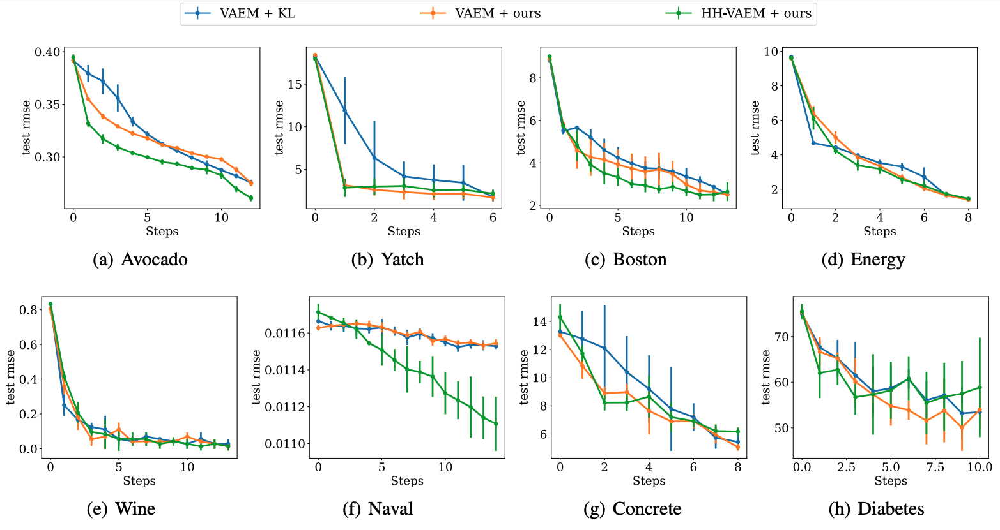
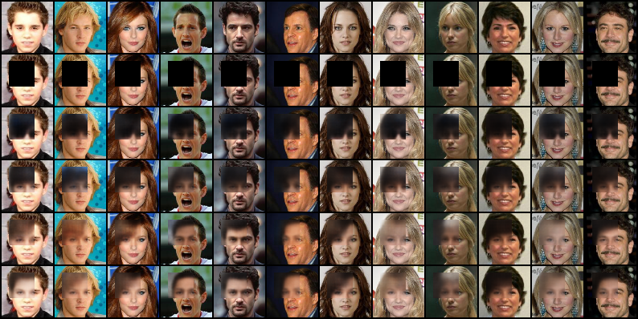

# HH-VAEM

This repository contains the official Pytorch implementation of the Hierarchical Hamiltonian VAE for Mixed-type Data (**HH-VAEM**) model and the sampling-based feature acquisition technique presented in the paper 
[Missing Data Imputation and Acquisition with Deep Hierarchical Models and Hamiltonian Monte Carlo](https://arxiv.org/pdf/2202.04599.pdf).  HH-VAEM is a Hierarchical VAE model for mixed-type incomplete data that uses Hamiltonian Monte Carlo with automatic hyper-parameter tuning for improved approximate inference. The repository contains the implementation and the experiments provided in the paper.

<p align="center">
  
</p>

Please, if you use this code, cite the [preprint](https://arxiv.org/pdf/2202.04599.pdf) using:
```
@inproceedings{peis2022missing,
  abbr={NeurIPS}, 
  title={Missing Data Imputation and Acquisition with Deep Hierarchical Models and Hamiltonian Monte Carlo},
  author={Peis, Ignacio and Ma, Chao and Hern{\'a}ndez-Lobato, Jos{\'e} Miguel},
  booktitle={Advances in Neural Information Processing Systems},
  volume={35},
  year={2022},
}
```

## Instalation 
The installation is straightforward using the following instruction, that creates a conda virtual environment named <code>HH-VAEM</code> using the provided file <code>environment.yml</code>:
```
conda env create -f environment.yml
```

## Usage

### Training
The project is developed in the recent research framework [PyTorch Lightning](https://www.pytorchlightning.ai/). The HH-VAEM model is implemented as a [<code>LightningModule</code>](https://pytorch-lightning.readthedocs.io/en/latest/common/lightning_module.html) that is trained by means of a [<code>Trainer</code>](https://pytorch-lightning.readthedocs.io/en/latest/common/trainer.html). A model can be trained by using:
```
# Example for training HH-VAEM on Boston dataset
python train.py --model HHVAEM --dataset boston --split 0
```
This will automatically download the <code>boston</code> dataset, split in 10 train/test splits and train HH-VAEM on the training split <code>0</code>. Two folders will be created: <code>data/</code> for storing the datasets and <code>logs/</code> for model checkpoints and [TensorBoard](https://www.tensorflow.org/tensorboard) logs. The variable <code>LOGDIR</code> can be modified in <code>src/configs.py</code> to change the directory where these folders will be created (this might be useful for avoiding overloads in network file systems).

The following datasets are available:
- A total of 10 UCI datasets: <code>avocado</code>, <code>boston</code>, <code>energy</code>, <code>wine</code>, <code>diabetes</code>, <code>concrete</code>, <code>naval</code>, <code>yatch</code>, <code>bank</code> or <code>insurance</code>.
- The MNIST datasets: <code>mnist</code> or <code>fashion_mnist</code>.
- More datasets can be easily added to <code>src/datasets.py</code>.
 
For each dataset, the corresponding parameter configuration must be added to <code>src/configs.py</code>.

The following models are also available (implemented in <code>src/models/</code>):
- <code>HHVAEM</code>: the proposed model in the paper.
- <code>VAEM</code>: the VAEM strategy presented in [(Ma et al., 2020)](https://arxiv.org/pdf/2006.11941.pdf) with Gaussian encoder (without including the
Partial VAE).
- <code>HVAEM</code>: A Hierarchical VAEM with two layers of latent variables and a Gaussian encoder.
- <code>HMCVAEM</code>: A VAEM that includes a tuned HMC sampler for the true posterior.
- For MNIST datasets (non heterogeneous data), use <code>HHVAE</code>, <code>VAE</code>, <code>HVAE</code> and <code>HMCVAE</code>.

By default, the test stage will be executed at the end of the training stage. This can be cancelled with <code>--test 0</code> for manually running the test using:
```
# Example for testing HH-VAEM on Boston dataset
python test.py --model HHVAEM --dataset boston --split 0
```
which will load the trained model to be tested on the <code>boston</code> test split number <code>0</code>. Once all the splits are tested, the average results can be obtained using the script in the <code>run/</code> folder:
```
# Example for obtaining the average test results with HH-VAEM on Boston dataset
python test_splits.py --model HHVAEM --dataset boston
```
## Experiments

<p align="center">
  
</p>

### SAIA experiment
The SAIA experiment in the paper can be executed using:
```
# Example for running the SAIA experiment with HH-VAEM on Boston dataset
python active_learning.py --model HHVAEM --dataset boston --method mi --split 0
```
Once this is executed on all the splits, you can plot the SAIA error curves using the scripts in the <code>run/</code> folder:
```
# Example for running the SAIA experiment with HH-VAEM on Boston dataset
python active_learning_plots.py --models VAEM HHVAEM --dataset boston
```

<br>
<p align="center">
  
</p>
<br>

### Inpainting

You can also try running the inpainting experiment using:
```
# Example for running the inpainting experiment using CelebA:
python inpainting.py --models VAE HVAE HMCVAE HHVAE --dataset celeba --split 0
```

which will stack a row of inpainted images for each of the given models, after two rows with the original and observed images, respectively.

<br>
<p align="center">
  
</p>
<br>


### Help
Use the <code>--help</code> option for documentation on the usage of any of the mentioned scripts. 


## Contact
For further information: <a href="mailto:ipeis@tsc.uc3m.es">ipeis@tsc.uc3m.es</a>
